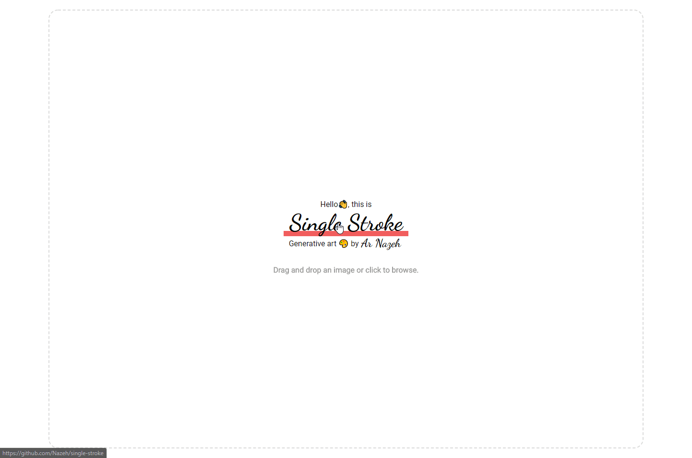

# Single Stroke

A generative art web-app 🎨 that converts any image into a spiral single stroke illustration!

  
  

## Installation

Clone the repository

`git clone --depth=1 git@github.com:nazeh/single-stroke.git <YOUR_PROJECT_NAME>`

## Setup

Install project dependencies

`yarn`

## Development

Run the local webpack-dev-server on http://localhost:8080/

`yarn start`
